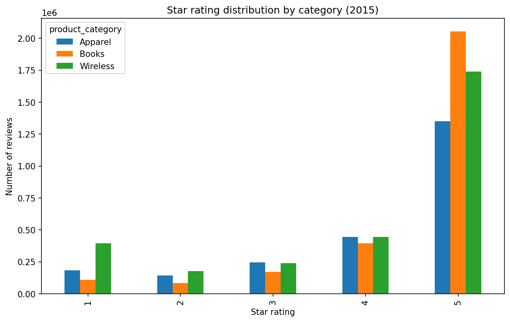
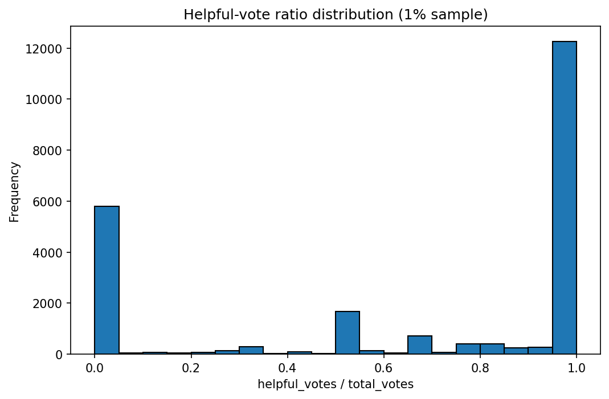
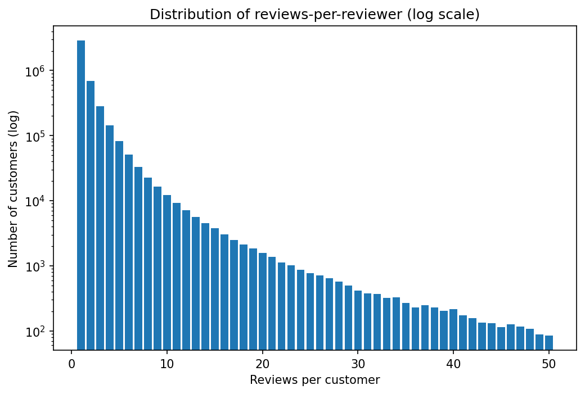
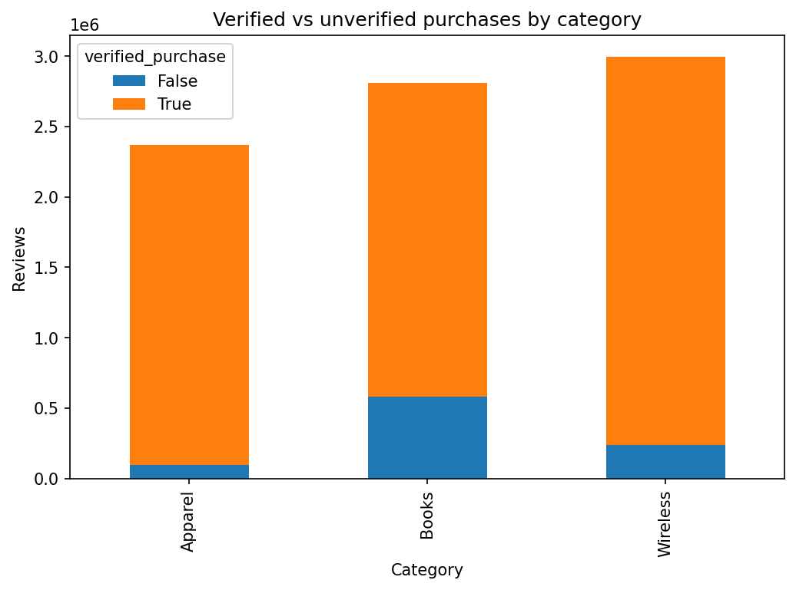
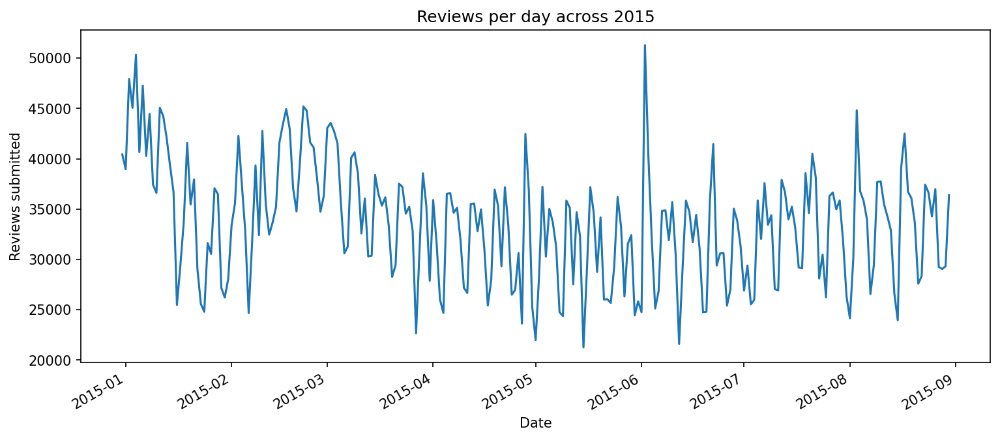
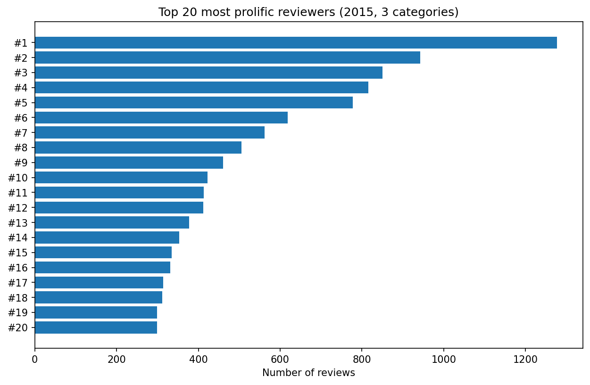

# Exploratory data analysis findings

## Dataset overview

Our analysis is based on an 8-month subset of the Amazon Customer Reviews
dataset (December 2014 through August 2015 — the date range present in the
ClickHouse public mirror's 2015 file), filtered to three product categories
(Wireless, Books, Apparel) yielding 8.2M reviews.

## Rating distribution

Across all three categories, ratings are heavily skewed positive. Approximately
57% of all reviews are 5-star, while 1-star reviews account for roughly 11%.
This bimodal pattern — heavy 5-star plus a smaller 1-star spike — is a known
characteristic of e-commerce review data and creates challenges for genuine
anomaly detection. Books shows the most pronounced 5-star volume (over 2.0M
5-star reviews), while Wireless shows the sharpest 1-star spike relative to
its mid-range ratings, consistent with literature on consumer-electronics
review fraud.

## Helpful-vote ratio

Of reviews receiving any votes, approximately 62% have a helpful-vote ratio
at or near 1.0 (the rightmost bar, ~12,300 in the 1% sample), while roughly
30% sit at or near 0.0 (the leftmost bar, ~5,800 in the 1% sample). The
strongly bimodal distribution confirms that reviews tend to polarize into
"clearly useful" and "clearly unhelpful" buckets, with very few middling
responses in the 0.1–0.4 range. We use the < 0.20 threshold as one
weak-supervision signal for likely-fraudulent content.

## Reviewer activity

The vast majority of customers post only 1 review (over 2M customers, the
tallest bar on the log-scale chart). The distribution follows a classic power
law: the count of customers drops by roughly an order of magnitude for each
additional review posted. Customers with 2 reviews number around 700K, those
with 3 reviews around 300K, and fewer than 100K customers post more than 10
reviews. The long tail — reviewers with 50 or more reviews in our 8-month window —
is small but represents a disproportionate share of all activity, and is a
known fraud-indicator pattern.

## Verified vs unverified purchases

Apparel shows the highest verified-purchase ratio at approximately 96%
(unverified blue segment is barely visible at ~100K out of 2.37M total).
Wireless follows at approximately 92% verified (~250K unverified out of 3.0M).
Books has the lowest verified ratio at approximately 79% (~580K unverified out
of 2.8M), consistent with the fact that digital and gifted books often cannot
be verified. Unverified reviews disproportionately concentrate in extreme
ratings — a documented fraud signal.

## Review velocity over time

Daily review submission volume ranged between approximately 22,000 and 51,000
reviews per day across the December 2014 to August 2015 window captured in the
dataset. The data does not show a simple upward trend; instead, volume
oscillates with a weekly rhythm (weekday peaks, weekend troughs) around a
relatively stable baseline of 30,000–38,000 reviews per day. The most notable
anomaly is a sharp single-day spike to ~51,000 reviews in mid-June 2015 —
a strong candidate for batch-fraud investigation, as it stands roughly 35%
above the surrounding baseline with no comparable run-up.

## Top reviewers

The most prolific reviewer in our sample posted approximately 1,270 reviews
across the three categories during the 8-month window — roughly 5.2 reviews
per day, or one every 4-5 hours on average. The second and third most prolific reviewers posted
approximately 950 and 850 reviews respectively. The top-20 cutoff sits at
around 295 reviews. While Amazon Vine reviewers (Amazon's incentivized
program) explain part of this activity, posting rates of 3+ reviews per day
sustained over an 8-month window are rare among genuine independent reviewers
and represent a known fraud-recruitment vector.